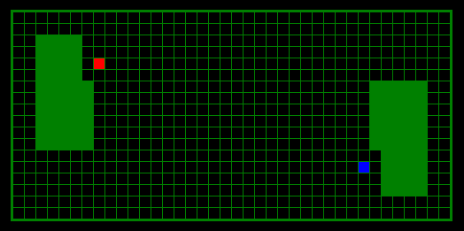
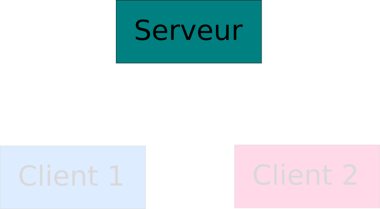
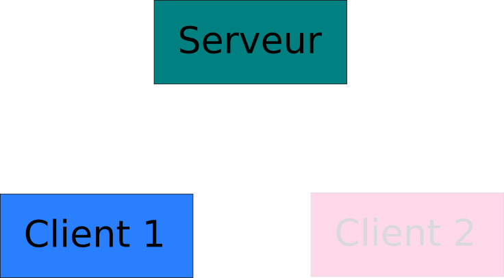
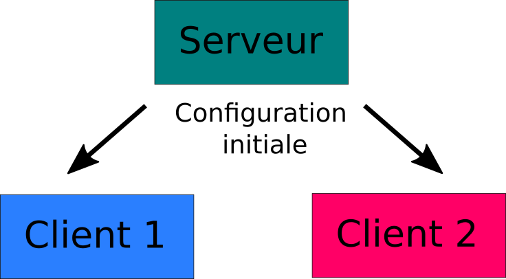
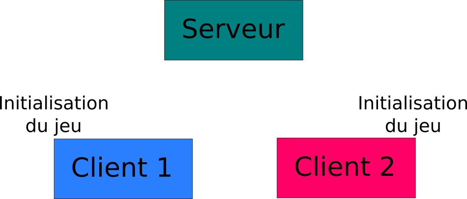
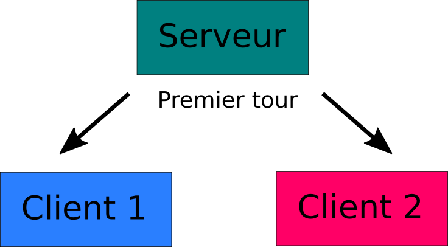
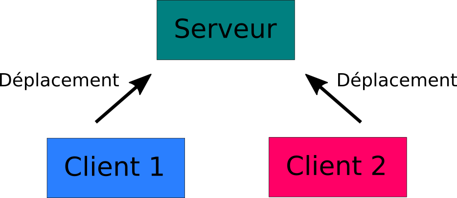

# IFT1015 - TP2 - Cybercycles

------------------------------------------------------------------

## Introduction

### Présentation du TP

Dans ce second projet vous aurez l'occasion de pratiquer les concepts suivants:

* La décomposition fonctionnelle
* Les tableaux multi-dimentionnels (encore)
* Les enregistrements
* La manipulation d'une page web (DOM & événements) via Javascript
* L'algorithmie, l'intelligence artificielle et la créativité

Vous devrez écrire deux clients pour un jeu multijoueur : l'un pour jouer avec un humain, l'autre qui joue automatiquement.


### Présentation du jeu

**Cybercycles** est une variante du jeu d'arcade multijoueur *TRON*.

Le principe est simple : deux joueurs munis de motos lumineuses s'affrontent sur un terrain rectangulaire rempli d'obstacles. En avançant, chaque joueur laisse derrière lui une trainée lumineuse mortelle qui constinue un obstacle de plus à éviter.

Le joueur qui reste en vie le plus longtemps est déclaré vainqueur.

*Cybercycles* est un jeu cruel : lorsqu'on rentre dans un mur, un obstacle ou la trainée lumineuse d'un joueur (la sienne ou celle de l'adversaire), on meurt sans deuxième chance.




## Fonctionnement du jeu

Le jeu est conçu avec une architecture clients/serveur. Autrement dit, lors d'une partie, trois programmes interagissent :

* Un serveur, qui attend que deux joueurs se connectent puis qui coordonne la partie
* Deux clients (qui ont possiblement le même code) qui se connectent au serveur et qui envoient périodiquement leurs déplacements

$\newline$


Voici de quoi aura l'air le déroulement d'une partie :

### Étape 0 : on lance le serveur, qui attend des connexions.

{width=60%} 


$\newline$
$\newline$

### Étape 1 : un premier client se connecte, le serveur attend que le deuxième joigne la partie.

{width=60%} 

$\newline$
$\newline$

### Étape 2 : un deuxième client se connecte, la partie commence. Le serveur envoie la configuration initiale du jeu et les numéros d'identification des joueurs (ID) aux clients.

{width=60%} 

$\newline$
$\newline$

### Étape 3 : les joueurs prennent le temps de noter l'état initial du jeu et possiblement d'initialiser l'affichage. La fonction createGrid(config) est appelée automatiquement à ce moment et doit se charger de tout ça.

{width=60%} 

$\newline$
$\newline$

### Étape 4 : le serveur envoie une première requête aux clients leur demandant leurs déplacements. La fonction nextMove() est appelée.

{width=60%} 

$\newline$
$\newline$

### Étape 5 : les clients répondent avec leur premier déplacement : u (up), d (down), l (left) ou r (right).

{width=60%} 

$\newline$
$\newline$

### Étape 6 : le serveur envoie une requête aux clients leur demandant leurs déplacements et leur indique les déplacements des deux joueurs au tour précédent. La fonction nextMove(previousMoves) est appelée avec en paramètre un tableau d'enregistrements contenant id/direction.

{width=60%} 

$\newline$
$\newline$

### Étape 7 : les clients répondent avec leur déplacement pour ce tour : u, d, l ou r.

{width=60%} 

$\newline$
$\newline$

### Les étapes 6 et 7 se répètent jusqu'à ce qu'au moins un des joueurs meurt.

### Étape 8 : lorsqu'au moins un des joueurs est mort, le serveur signale aux clients la fin de la partie et leur envoie l'ID du joueur ayant gagné, ou 0 si c'est un match nul. La fonction victory(winner) est appelée.

{width=60%} 

$\newline$
$\newline$

### Étape 9 : les clients se déconnctent et le serveur attend des nouvelles connexions pour recommencer une nouvelle partie.

{width=60%} 

$\newline$
$\newline$


## Implantation

Votre travail sera d'écrire le code de deux clients qui se connecteront au serveur :

* Un client humain, pour pouvoir jouer avec les flèches du clavier
* Un client avec une intelligence artificielle pouvant jouer tout seul

De plus, votre client humain devra s'occuper de dessiner la grille de jeu à l'écran. Vous pouvez utiliser les fonctions fournies dans le TP1, soient `Grid.create(width, height)` et `Grid.colorCell(x, y, color)` si vous le souhaitez, ou vous pouvez décider de créer votre propre grille en manipulant le DOM tel que vu en classe. Soyez créatifs, faites quelque chose de joli !

Votre intelligence artificielle doit implanter quatre fonctions qui seront appellées par le jeu, `setGrid(x, y, val)`, `createGrid(config)`, `nextMove(previousMoves)`, `victory(winner)`.

Référez-vous aux commentaires dans les fichiers `client/human.js` et `client/ai.js` pour vous guider dans votre implantation.

## Détails techniques

Pour faire ce TP, vous aurez besoin d'installer [Node.js](https://nodejs.org/).

Téléchargez la version par défaut depuis le site et suivez les instructions.


### Lancer le serveur de jeu avec `node.js`

Vous pouvez lancer le serveur en ouvrant un terminal, en tapant :

```bash
    cd chemin/vers/tp2/server/
    chemin/vers/node index.js
```

Si tout s'est bien passé, vous devriez voir :

        Serveur démarré, en attente de connexions...

Pour éteindre le serveur, entrez Ctrl+C (windows, mac, linux, peu importe) ou fermez la fenêtre du terminal.

### Tester le jeu

Pour des fins de test, vous pouvez spécifier au serveur de ne pas générer d'obstacles et de donner comme positions de départ les coins de la grille en utilisant le paramètre `--test` :

        chemin/vers/node index.js --test

Une fois le serveur démarré, vous pouvez lancer le client de test en ouvrant le fichier `ai-test.html` *2 fois, dans 2 onglets séparés de votre navigateur* (pour lancer 2 clients).

Vous pourrez regarder l'avancement de la partie dans la console où vous avez lancé le serveur.


### Lancer d'autres clients

Pour tester votre implantation du client humain, ouvrez `human.html` dans votre navigateur. Pour tester votre robot, ouvrez plutôt `ai.html`.


## Évaluation

Ce travail sera évalué selon le barème suivant :

* 50% pour le client humain
    * On peut jouer avec les flèches du clavier
    * La grille de jeu est affichée en temps réel et sans erreur
* 50% pour votre intelligence artificielle
    * 15% sur la qualité du code (fonctionnement sans erreur, découpage fonctionnel, etc.)
    * 35% attribués sur le fait d'arriver à battre différents robots que nous avons conçus  :
        1. Un robot qui va dans une direction aléatoire comportant une case libre à chaque tour
        2. Un robot qui va en ligne droite jusqu'à frapper un mur, puis qui prend une direction aléatoire
        3. Un robot qui choisi la direction dans laquelle aller en considérant la quantité de cases disponibles dans son voisinage immédiat
        4. Un robot plus avancé dont vous ne connaissez pas l'algorithme
* **10% bonus** attribués selon un tournoi entre les intelligences artificielles des différentes équipes dans la classe

Notez qu'en raison du caractère aléatoire du jeu, "arriver à battre" sera interprété comme : "arriver à batter une majorité de fois sur plusieurs parties".

Aucun test unitaire n'est exigé pour ce TP. Vous pouvez bien sûr décider d'en écrire si vous le souhaitez, mais ils ne seront pas évalués.

## Indications supplémentaires

* Ce travail compte pour 15% dans la note finale du cours. Vous **devez** faire le travail par groupes de 2 personnes. Indiquez vos noms clairement dans les commentaires au début de votre code. Un travail fait seul engendrera une lourde pénalité (qui ne peut **pas** être compensée par les points bonus). Les équipes de plus de deux seront refusées.

* Vous devez seulement remettre deux fichiers : `ai.js` et `human.js`.

* Voici les critères d'évaluation du code :
    * l'exactitude (respect de la spécification)
    * l'élégance et la lisibilité du code
    * la présence de commentaires explicatifs lorsque nécessaire
    * le choix des identificateurs
    * la décomposition fonctionnelle et le choix de tests unitaires pertinents

* De plus :
    * La performance de votre code doit être raisonnable.
    * Chaque fonction devrait avoir un bref commentaire pour indiquer ce qu'elle fait.
    * Il devrait y avoir des lignes blanches pour que le code ne soit pas trop dense (utilisez votre bon sens pour arriver à un code facile à lire)
    * Les identificateurs doivent être bien choisis pour être compréhensibles (évitez les noms à une lettre, à l'exception de `i`, `j`, ... pour les variables d'itérations des boucles `for`).
    * Vous devez respecter le standard de code pour ce projet (soit, les noms de variables en camelCase).
    * Il ne devrait plus y avoir de code de debug (aka, `console.log(...)`) dans la version finale remise.
